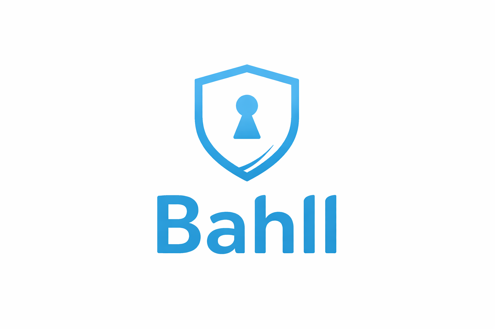
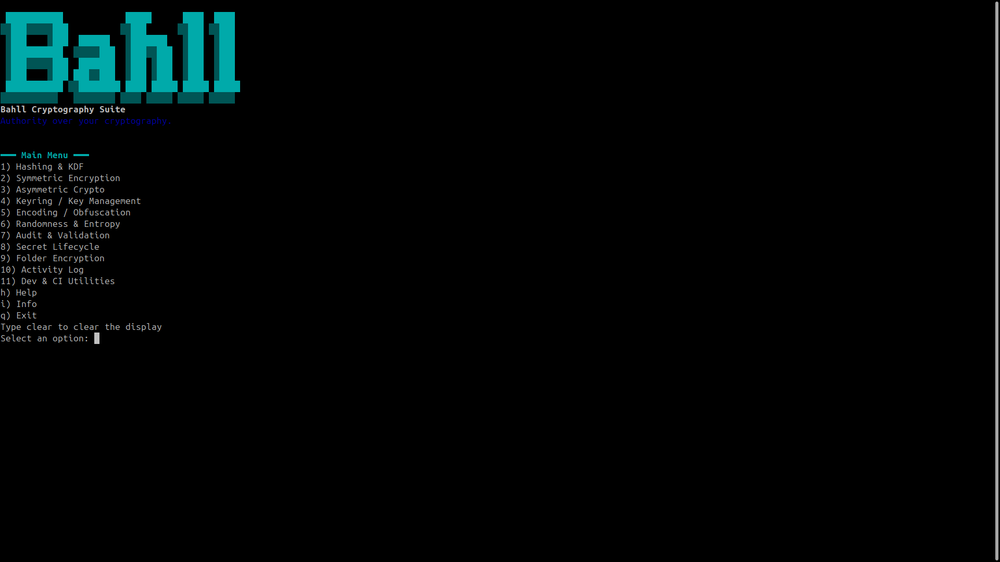

<div align="center">
  

  <h1>🔐 Bahll Cryptography Suite</h1>
  <p><em>Authority over your cryptography.</em></p>

  <!-- Badges -->
  <p>
    
    
    
    
    
  </p>

  <!-- Demo GIF -->
  <p>
    
  </p>

  <p>
    <a href="#features">🔑 Features</a> •
    <a href="#installation">📦 Installation</a> •
    <a href="#usage">🚀 Usage</a> •
    <a href="#security">🛡️ Security</a> •
    <a href="#screenshots">📸 Screenshots</a> •
    <a href="#contributing">🤝 Contributing</a>
  </p>
</div>

---

## Overview

Bahll is a **terminal defensive cryptography toolkit** designed for developers who need reliable, secure crypto operations without the complexity of custom implementations. Built with PHP, it provides an interactive CLI menu for hashing, encryption, key management, auditing, and more — all while enforcing secure-by-default practices.

Whether you're a developer integrating crypto into your app, a security engineer auditing secrets, or just experimenting with cryptography, Bahll gives you authority over your crypto workflows.

## Features

Bahll offers a comprehensive suite of cryptographic tools, organized into intuitive categories:

### 🔑 Hashing & Key Derivation Functions (KDF)
- **SHA-1** (⚠️ with deprecation warning)
- **SHA-256, SHA-512** 🛡️
- **SHA3** (when available)
- **BLAKE2 / BLAKE3** (availability checked)
- **HMAC** 🔐 for message authentication
- **PBKDF2** 🏗️ for password-based key derivation
- **bcrypt** and **scrypt** 🔒 for secure password hashing
- **Argon2id** 🏆 for modern KDF

### 🔒 Symmetric Encryption
- **AES-256-GCM** (default, AEAD mode) 🛡️
- **AES-CBC** (with HMAC, warned as insecure without AEAD) ⚠️
- **ChaCha20-Poly1305** (when libsodium available) 🔐
- Password-based encryption with automatic IV/salt handling 🔑
- File and string encryption/decryption 📁

### 🔐 Asymmetric Cryptography
- **RSA** keypair generation (2048+ bits enforced) 🔑
- **Ed25519** for fast, secure signing 📝
- **ECDSA** support
- **X25519** for key exchange 🔄
- Sign and verify files/messages ✅
- Key strength validation 🛡️

### 🗝️ Key Management
- **Encrypted local keyring** with passphrase protection 🔒
- Import/export keys securely 📤📥
- Key rotation and expiration ⏰
- List keys with metadata 📋
- Enforce strong passphrase policies 🛡️

### � **[NEW] Folder Encryption Manager**
- 🔒 **Encrypt entire folder structures** with password protection
- 📂 Recursive directory support with metadata preservation
- 🔑 Secure key derivation (SHA-256)
- 📊 Real-time encryption statistics and progress
- 🗂️ Automatic folder structure creation
- 📁 Decryption with output to separate directory

### 📋 **[NEW] Activity Logging System**
- 📝 **Complete audit trail** of all cryptographic operations
- 🛡️ **Non-sensitive logging** - passwords/keys never recorded
- 🔐 **Base64-encoded storage** for additional obfuscation
- 🔍 **Smart sanitization** - removes hex strings, base64 blobs, tokens
- 📊 Real-time statistics: entry count, file size, timestamps
- 📤 **Export logs** for compliance and auditing purposes

### 📝 Encoding & Obfuscation
- **Base64** (standard and URL-safe) 🔤
- **Base32** and **Base58** 🔢
- **Hex** encoding/decoding 🔟
- **ASCII armor** for PEM-like formats 📄

### 🎲 Randomness & Entropy
- **CSPRNG** token generation 🎰
- Secure password generator 🔑
- Entropy warnings ⚠️ for weak sources

### 🔍 Crypto Audit & Validation
- Detect weak keys and insecure ciphers 🔍
- Warn on deprecated algorithms ⚠️
- Human-readable security reports 📊
- Score your crypto configurations 🏆

### 🔄 Secret Lifecycle Management
- Scan files for secrets 🔎
- Mask and rotate secrets 🔄
- Revoke keys and enforce expiration ⏰
- Pre-commit hooks for security scans 🪝
- **[NEW] Generate secure passwords, tokens, salts** instantly

### 🛠️ Dev & CI Utilities
- Pre-commit security scanning 🪝
- Artifact signing and verification ✍️
- Release integrity checks ✅
- Machine-readable CI output 🤖

### 🔌 Plugin System
- Extensible architecture for custom crypto components 🧩
- Safe module loading 🛡️
- Folder-based plugin discovery 📁

## Architecture

Bahll follows a **modular, CLI-first architecture**:
- **No web dependencies**: Pure terminal tool.
- **Plugin system**: Safe loading of custom components.
- **Encrypted storage**: Keyring uses libsodium AEAD for security.
- **Fail-closed design**: Errors halt execution with clear messages.
- **PSR-4 autoloading**: Standard PHP structure.

Built for developers, by developers — secure, simple, and extensible.

### Workflow Diagram
```
User Input → CLI Menu → Core Module → Secure Operation → Output
     ↓           ↓          ↓            ↓             ↓
  Prompt    Navigation  Hash/Sym/Asym  Validation   Result
```

### Security Layers
| Layer | Description | Tech |
|-------|-------------|------|
| Input | Sanitized prompts | PHP CLI |
| Crypto | Audited primitives | OpenSSL/Sodium |
| Storage | Encrypted keyring | AEAD (XChaCha20) |
| Audit | Real-time checks | Built-in validators |
| Output | Clear error messages | Fail-closed |

## Installation

1. **Clone the repository:**
   ```bash
   git clone https://github.com/BangAguse/Bahll.git
   cd Bahll
   ```

2. **Run the setup script:**
   ```bash
   php setup.php
   ```
   This checks extensions, creates necessary directories, and generates `composer.json`.

3. **Install dependencies (if using Composer):**
   ```bash
   composer install
   ```

That's it! Bahll has no external PHP dependencies — it uses only built-in extensions.

## Usage

Start the interactive CLI:

```bash
php bahll.php
```

You'll see the ASCII banner, then a main menu with categories. Navigate using numbers, enter data as prompted, and results are displayed inline.

### Example: Hash a string
1. Select "1) Hashing & KDF"
2. Choose "2) SHA-256"
3. Enter your string
4. Get the hash output

### Example: Encrypt a file
1. Select "2) Symmetric Encryption"
2. Choose "1) AES-256-GCM encrypt string"
3. Provide plaintext and optional password
4. Receive a base64-encoded blob for decryption

### Example: Generate RSA keys
1. Select "3) Asymmetric Crypto"
2. Choose "1) Generate RSA keypair"
3. Specify key size (2048+)
4. Get PEM-formatted keys

For automation, Bahll can be scripted or integrated into CI pipelines via its CLI output.

## Security

Bahll is built with a **fail-closed, defensive mindset**:
- Rejects weak configurations (e.g., RSA < 2048 bits) with clear error messages like "✖ Rejected by Bahll: Weak cryptographic configuration detected"
- Uses constant-time comparisons for sensitive operations
- Prefers AEAD modes (GCM, Poly1305) over vulnerable CBC
- Warns on deprecated algorithms (SHA-1)
- No custom crypto — only audited, standard primitives

Always verify outputs and use in production with caution. Bahll is designed for secure development workflows.

## Screenshots

### Main Menu


## Contributing

We welcome contributions! Here's how to get started:

1. Fork the repo and clone locally
2. Run `php setup.php` and `composer install`
3. Make changes, add tests in `tests/`
4. Run `php bahll.php` to test interactively
5. Submit a PR with a clear description

For bugs or features, open an issue. Follow PHP PSR-12 coding standards.

## ☕ Support Me

Jika proyek ini bermanfaat dan membantu pekerjaanmu, kamu bisa mendukung pengembangannya
melalui donasi sebagai bentuk apresiasi terhadap karya open-source ini.

<p align="center">
  <br>
  <b>DANA:</b> 085756444803
</p>

Dukunganmu membantu proyek ini tetap hidup, terawat, dan terus dikembangkan 🚀

## License

MIT License — see [LICENSE](LICENSE) for details.

---

*Built with ❤️ for secure development workflows.*
