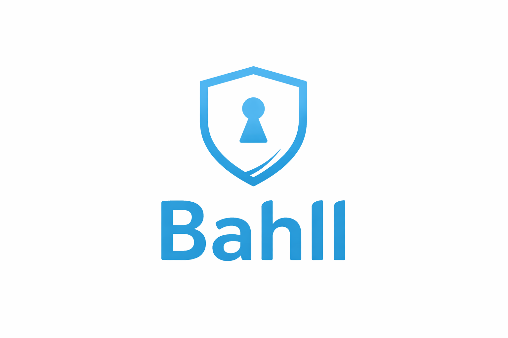
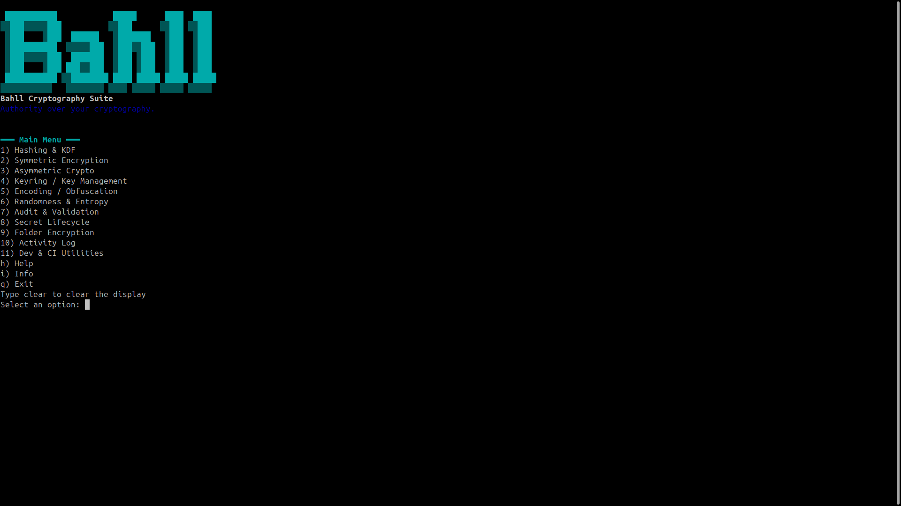

<div align="center">
  

  <h1>🔐 Bahll Cryptography Suite</h1>
  <p><em>Authority over your cryptography.</em></p>

  <!-- Badges -->
  <p>
    
    
    
    
    
  </p>

  <!-- Demo GIF -->
  <p>
    
  </p>

  <p>
    <a href="#features">🔑 Features</a> •
    <a href="#installation">📦 Installation</a> •
    <a href="#usage">🚀 Usage</a> •
    <a href="#security">🛡️ Security</a> •
    <a href="#screenshots">📸 Screenshots</a> •
    <a href="#contributing">🤝 Contributing</a>
  </p>

  <p>
    <a href="https://github.com/BangAguse/Bahll"><strong>📁 GitHub: BangAguse/Bahll</strong></a>
  </p>
</div>

---

## Overview

Bahll is a **terminal defensive cryptography toolkit** designed for developers who need reliable, secure crypto operations without the complexity of custom implementations. Built with PHP, it provides an interactive CLI menu for hashing, encryption, key management, auditing, and more — all while enforcing secure-by-default practices.

Whether you're a developer integrating crypto into your app, a security engineer auditing secrets, or just experimenting with cryptography, Bahll gives you authority over your crypto workflows.

### 🆕 What's New in v1.1 - REST API Server Integration

**Bahll v1.1 adds a production-ready REST API Server to the dual-mode tool:**

1. **Interactive Mode** - Traditional menu-driven interface
   ```bash
   php bahll.php          # Full interactive menu
   ```

2. **Direct CLI Commands** - Execute operations without menu navigation
   ```bash
   # Flag-style (modern & recommended)
   bahll --hash --algo=sha256 --data="test"
   bahll --encrypt --algo=aes-256-gcm --data=/path/to/file
   
   # Positional (still supported)
   php bahll.php hash sha256 "test"
   php bahll.php encrypt aes-256-gcm "data" "key"
   ```

3. **System Command Setup** - Install `bahll` as a direct terminal command (no `php` prefix)
   ```bash
   # Make it available globally
   chmod +x /path/to/Bahll/bahll.php
   sudo ln -sf /path/to/Bahll/bahll.php /usr/local/bin/bahll
   
   # Now run anywhere:
   bahll --help
   bahll --hash --algo=sha256 --data="hello"
   ```

**Key Benefits:**
- ✅ **Scripting-friendly** - Use in shell scripts, CI/CD pipelines, cron jobs
- ✅ **No syntax memorization** - Long-flag format is self-documenting
- ✅ **File workflows** - Auto-confirmation & optional passphrase for file operations
- ✅ **Batch operations** - Encrypt/decrypt directories with single command
- ✅ **System integration** - Works like any native CLI tool

## Features

Bahll offers a comprehensive suite of cryptographic tools, organized into intuitive categories:

### 🔑 Hashing & Key Derivation Functions (KDF)
- **SHA-1** (⚠️ with deprecation warning)
- **SHA-256, SHA-512** 🛡️
- **SHA3** (when available)
- **BLAKE2 / BLAKE3** (availability checked)
- **HMAC** 🔐 for message authentication
- **PBKDF2** 🏗️ for password-based key derivation
- **bcrypt** and **scrypt** 🔒 for secure password hashing
- **Argon2id** 🏆 for modern KDF

### 🔒 Symmetric Encryption
- **AES-256-GCM** (default, AEAD mode) 🛡️
- **AES-CBC** (with HMAC, warned as insecure without AEAD) ⚠️
- **ChaCha20-Poly1305** (when libsodium available) 🔐
- Password-based encryption with automatic IV/salt handling 🔑
- File and string encryption/decryption 📁

### 🔐 Asymmetric Cryptography
- **RSA** keypair generation (2048+ bits enforced) 🔑
- **Ed25519** for fast, secure signing 📝
- **ECDSA** support
- **X25519** for key exchange 🔄
- Sign and verify files/messages ✅
- Key strength validation 🛡️

### 🗝️ Key Management
- **Encrypted local keyring** with passphrase protection 🔒
- Import/export keys securely 📤📥
- Key rotation and expiration ⏰
- List keys with metadata 📋
- Enforce strong passphrase policies 🛡️

### � **Folder Encryption Manager**
- 🔒 **Encrypt entire folder structures** with password protection
- 📂 Recursive directory support with metadata preservation
- 🔑 Secure key derivation (SHA-256)
- 📊 Real-time encryption statistics and progress
- 🗂️ Automatic folder structure creation
- 📁 Decryption with output to separate directory

### 📋 **Activity Logging System**
- 📝 **Complete audit trail** of all cryptographic operations
- 🛡️ **Non-sensitive logging** - passwords/keys never recorded
- 🔐 **Base64-encoded storage** for additional obfuscation
- 🔍 **Smart sanitization** - removes hex strings, base64 blobs, tokens
- 📊 Real-time statistics: entry count, file size, timestamps
- 📤 **Export logs** for compliance and auditing purposes

### 📝 Encoding & Obfuscation
- **Base64** (standard and URL-safe) 🔤
- **Base32** and **Base58** 🔢
- **Hex** encoding/decoding 🔟
- **ASCII armor** for PEM-like formats 📄

### 🎲 Randomness & Entropy
- **CSPRNG** token generation 🎰
- Secure password generator 🔑
- Entropy warnings ⚠️ for weak sources

### 🔍 Crypto Audit & Validation
- Detect weak keys and insecure ciphers 🔍
- Warn on deprecated algorithms ⚠️
- Human-readable security reports 📊
- Score your crypto configurations 🏆

### 🔄 Secret Lifecycle Management
- Scan files for secrets 🔎
- Mask and rotate secrets 🔄
- Revoke keys and enforce expiration ⏰
- Pre-commit hooks for security scans 🪝
- **Generate secure passwords, tokens, salts** instantly

### 🛠️ Dev & CI Utilities
- Pre-commit security scanning 🪝
- Artifact signing and verification ✍️
- Release integrity checks ✅
- Machine-readable CI output 🤖

### 🔌 Plugin System
- Extensible architecture for custom crypto components 🧩
- Safe module loading 🛡️
- Folder-based plugin discovery 📁

## Project Structure

```
Bahll/
├─ bahll.php          # Main entry point
├─ setup.php          # Environment setup script
├─ composer.json      # PHP dependencies config
├─ core/              # Core crypto modules
│  ├─ crypto/         # Hash, Symmetric, Asymmetric
│  ├─ keyring/        # Encrypted key storage
├─ cli/               # CLI interface
│  ├─ menu/           # Interactive menus
│  ├─ input/          # Input handling
│  ├─ output/         # Output rendering
├─ utils/             # Utilities (e.g., constant-time compare)
├─ storage/           # Encrypted data storage
├─ plugins/           # Extensible plugins
├─ tests/             # Unit tests
├─ docs/assets/       # Documentation assets
└─ README.md          # This file
```

## Architecture

Bahll follows a **modular, CLI-first architecture**:
- **No web dependencies**: Pure terminal tool.
- **Plugin system**: Safe loading of custom components.
- **Encrypted storage**: Keyring uses libsodium AEAD for security.
- **Fail-closed design**: Errors halt execution with clear messages.
- **PSR-4 autoloading**: Standard PHP structure.

Built for developers, by developers — secure, simple, and extensible.

### Workflow Diagram
```
User Input → CLI Menu → Core Module → Secure Operation → Output
     ↓           ↓          ↓            ↓             ↓
  Prompt    Navigation  Hash/Sym/Asym  Validation   Result
```

### Security Layers
| Layer | Description | Tech |
|-------|-------------|------|
| Input | Sanitized prompts | PHP CLI |
| Crypto | Audited primitives | OpenSSL/Sodium |
| Storage | Encrypted keyring | AEAD (XChaCha20) |
| Audit | Real-time checks | Built-in validators |
| Output | Clear error messages | Fail-closed |

## Installation

1. **Clone the repository:**
   ```bash
   git clone https://github.com/BangAguse/Bahll.git
   cd Bahll
   ```

2. **Run the setup script:**
   ```bash
   php setup.php
   ```
   This checks extensions, creates necessary directories, and generates `composer.json`.

3. **Install dependencies (if using Composer):**
   ```bash
   composer install
   ```

That's it! Bahll has no external PHP dependencies — it uses only built-in extensions.

## Usage

### Interactive Mode

Start the interactive CLI:

```bash
php bahll.php
```

You'll see the ASCII banner, then a main menu with categories. Navigate using numbers, enter data as prompted, and results are displayed inline.

#### Example: Hash a string
1. Select "1) Hashing & KDF"
2. Choose "2) SHA-256"
3. Enter your string
4. Get the hash output

#### Example: Encrypt a file
1. Select "2) Symmetric Encryption"
2. Choose "1) AES-256-GCM encrypt string"
3. Provide plaintext and optional password
4. Receive a base64-encoded blob for decryption

#### Example: Generate RSA keys
1. Select "3) Asymmetric Crypto"
2. Choose "1) Generate RSA keypair"
3. Specify key size (2048+)
4. Get PEM-formatted keys

### CLI Command Mode (NEW!)

Bahll now supports direct command-line execution for easy scripting and automation:

```bash
# Hash operations
php bahll.php hash sha256 "Hello World"
php bahll.php hash bcrypt "password123"
php bahll.php hash argon2 "secure-password" 65536

# Encryption/Decryption
php bahll.php encrypt aes-256-gcm "secret-data" "encryption-key"
php bahll.php decrypt aes-256-gcm "[encrypted-blob]" "encryption-key"

# Key generation
php bahll.php asymmetric generate rsa-4096
php bahll.php asymmetric generate ed25519

# Random data
php bahll.php random bytes 32
php bahll.php random token 32
php bahll.php random password 16
php bahll.php random string 20

# Encoding
php bahll.php encoding base64 "data"
php bahll.php encoding hex "data"
php bahll.php encoding url "data"

# Auditing
php bahll.php audit check
php bahll.php audit hash-file /path/to/file sha256

# Activity logs
php bahll.php logs view
php bahll.php logs export

# Help & Version
php bahll.php --help
php bahll.php --version
```

### CLI Flag-Style Commands (NEW!)

Bahll now supports modern flag-based commands for scripting:

```bash
# Hashing
bahll --hash --algo=sha256 --data="Hello World"

# Encryption (file-based)
bahll --encrypt --algo=aes-256-gcm --data=/path/to/file.txt --key=password
# Output: /path/to/file.txt.bahll

# Decryption (file-based)
bahll --decrypt --algo=aes-256-gcm --data=/path/to/file.txt.bahll --key=password
# Output: /path/to/file.txt.dec

# Random data
bahll --random --type=bytes --length=32

# Directory bruteforce
bahll --bruteforce --path=/path/to/encrypted_folder

# Help
bahll --help
```

### Installation as System Command

Make `bahll` executable from anywhere:

```bash
# System-wide (requires sudo)
chmod +x /path/to/Bahll/bahll.php
sudo ln -sf /path/to/Bahll/bahll.php /usr/local/bin/bahll

# Or per-user (no sudo)
mkdir -p "$HOME/bin"
cat > "$HOME/bin/bahll" <<'EOF'
#!/bin/sh
php /path/to/Bahll/bahll.php "$@"
EOF
chmod +x "$HOME/bin/bahll"
```

**Full CLI Documentation:** See [CLI_DOCUMENTATION.md](CLI_DOCUMENTATION.md) for complete command reference and [CLI_QUICK_REFERENCE.md](CLI_QUICK_REFERENCE.md) for quick lookup.

### Integration Examples

**Shell Scripts:**
```bash
#!/bin/bash
# Generate secure API key
API_KEY=$(php bahll.php random token 32)

# Hash it for storage
API_HASH=$(php bahll.php hash sha256 "$API_KEY")

echo "Generated key: $API_KEY"
echo "Stored hash: $API_HASH"
```

**PHP Integration:**
```php
<?php
// Generate random password in PHP
$password = shell_exec('php /path/to/bahll.php random password 16');

// Hash configuration with AES-256
$config = file_get_contents('config.php');
$encrypted = shell_exec("php /path/to/bahll.php encrypt aes-256-gcm " . escapeshellarg($config) . " " . escapeshellarg($masterKey));
?>
```

**CI/CD Pipeline (GitHub Actions):**
```yaml
- name: Generate signing key
  run: php bahll.php random token 32 > signing-key.txt

- name: Hash dependencies  
  run: |
    php bahll.php audit hash-file composer.lock sha256 > deps.hash
    php bahll.php audit hash-file package.json sha256 >> deps.hash
```

For automation, Bahll can be scripted or integrated into CI pipelines via its CLI output.

## CLI Examples (flag-style)

Encryption & decryption using flags (recommended for scripting):

```bash
# Encrypt a file (prompts confirmation and optional passphrase)
php bahll.php --encrypt --algo=aes-256-gcm --data=/home/user/secret.txt --key="optional-key"

# Decrypt a file (prompts confirmation and optional passphrase)
php bahll.php --decrypt --algo=aes-256-gcm --data=/home/user/secret.txt.bahll --key="optional-key"

# Hash data using flag
php bahll.php --hash --algo=sha256 --data="Hello World"

# Bruteforce a directory (ethical confirmation required)
php bahll.php --bruteforce --path=/home/user/encrypted_folder
```

These flag-style commands are fully scriptable and suitable for CI. Positional usage (`php bahll.php encrypt aes-256 "data" "key"`) remains supported for backwards compatibility.

## Security

Bahll is built with a **fail-closed, defensive mindset**:
- Rejects weak configurations (e.g., RSA < 2048 bits) with clear error messages like "✖ Rejected by Bahll: Weak cryptographic configuration detected"
- Uses constant-time comparisons for sensitive operations
- Prefers AEAD modes (GCM, Poly1305) over vulnerable CBC
- Warns on deprecated algorithms (SHA-1)
- No custom crypto — only audited, standard primitives

Always verify outputs and use in production with caution. Bahll is designed for secure development workflows.

## Screenshots

### Main Menu


## Contributing

We welcome contributions! Here's how to get started:

1. **Fork** the repo at [github.com/BangAguse/Bahll](https://github.com/BangAguse/Bahll)
2. Clone locally: `git clone https://github.com/BangAguse/Bahll.git`
3. Run `php setup.php` and `composer install`
4. Make changes, add tests in `tests/`
5. Run `php bahll.php` to test interactively
6. Submit a PR with a clear description

For bugs or features, open an issue at [github.com/BangAguse/Bahll/issues](https://github.com/BangAguse/Bahll/issues). Follow PHP PSR-12 coding standards.

**Repository:** [github.com/BangAguse/Bahll](https://github.com/BangAguse/Bahll)  
**Author:** [@BangAguse](https://github.com/BangAguse)

## License

MIT License — see [LICENSE](LICENSE) for details.

---

*Built with ❤️ for secure development workflows.*
